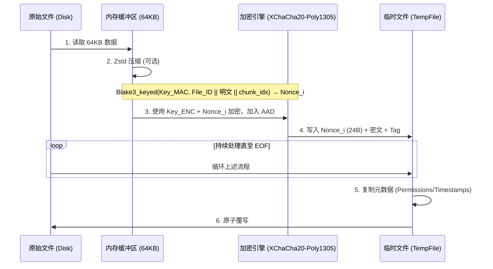

# 行为准则

你是一个资深 Rust 工程师，注重代码可维护性和性能优化，并且遵循 Rust 工程开发的最佳实践

- 少造轮子，如果有合适的第三方库就用
- 少写重复代码，多抽离出可复用的组件，并考虑向后扩展性
  - 你应该使用在编译期就能进行错误检查的设计，而不是推到运行期检查，例如多用枚举，不用硬编码。
- 单测、集成测试需要"少而精"，不要对过于简单的部分写太多单测，易错部分要多写
- 不要删除代码中运行逻辑相关的关键注释
- 使用简体中文进行交流；在代码中使用英文注释

## 项目要求

- 「单密码对称加密」这一底层逻辑不允许改变
- 所有变更都需要兼容 major version 内的之前版本

## 加密核心算法

### 1. 密钥派生

- 程序通过 Argon2 算法结合文件的 16B Salt 派生出 32B 的 Master Key，再通过 `blake3::derive_key` 拆分为两个独立密钥，用于 XChaCha20-Poly1305 加密 + 计算每个分块的 Nonce。
  - 利用 `DashMap<Salt, Arc<OnceLock>>` 缓存已派生的密钥，减少重复 Argon2 运算。

### 2. 头部结构

每个加密文件都包含一个标准头部（64 字节）：

```text
 00          04  05  06  07           17                  27              3F
 +-----------+---+---+---+-----------+-------------------+---------------+
 |   MAGIC   | V | F | A |   SALT    |      FILE_ID      |   RESERVED    |
 |  "GITSE"  |   |   |   | (16 bytes)|    (16 bytes)     |  (24 bytes)   |
 +-----------+---+---+---+-----------+-------------------+---------------+
      |        |   |   |
      |        |   |   +--- 加密算法 (1 = XChaCha20-Poly1305)
      |        |   +------- 压缩标志位 (Bit 0: 是否 Zstd 压缩)
      |        +----------- 版本号 (当前为 3)
      +-------------------- 魔数
```

- FILE_ID：每次加密新文件时随机生成的 16 字节标识符，用于 Nonce 派生。

### 3. 加密逻辑

- 算法： 文件被切分为 64KB 的块，使用 XChaCha20-Poly1305 进行加密。
- Nonce 派生： 每个 chunk 的 nonce 基于 File_ID 和当前块自身的明文内容，通过带密钥的 Blake3 哈希计算：`Nonce_i = Blake3_keyed(Key_MAC, File_ID || M_i || chunk_idx)[0..24]`
- AAD： 完整的 64B HEADER + chunk_idx (8B) + is_last_chunk (1B)，共 73B。HEADER 参与所有 chunk 的 AAD 绑定。
- 存储格式： 每个加密分块的物理结构为 `[NONCE (24B)] [CIPHERTEXT (<= 64KB)] [Poly1305 TAG (16B)]`，Nonce 存储在分块头部。



解密：从文件读取 24 字节作为 `Nonce_i`，读取后续的密文 + Tag，直接调用 XChaCha20-Poly1305 解密。

### 4. 确定性重加密（Salt + File_ID 缓存）

为保证 decrypt -> encrypt 循环对相同文件产生完全相同的密文，程序在 `.git/git-simple-encrypt-salt-cache` 中持久化每个文件的 Salt 和 File_ID。

- 加密（只读缓存）：通过 mmap 将缓存文件映射到内存，rkyv zerocopy 反序列化直接查询。
- 解密（写入缓存）：Rayon 线程通过 mpsc channel 发送 `(path, salt, file_id)`，主线程收集后通过 rkyv 序列化，并原子写入到磁盘，与已有缓存合并。
  - 缓存 key 使用仓库相对路径的原始字节（`/` 作为分隔符），确保跨平台一致性。
