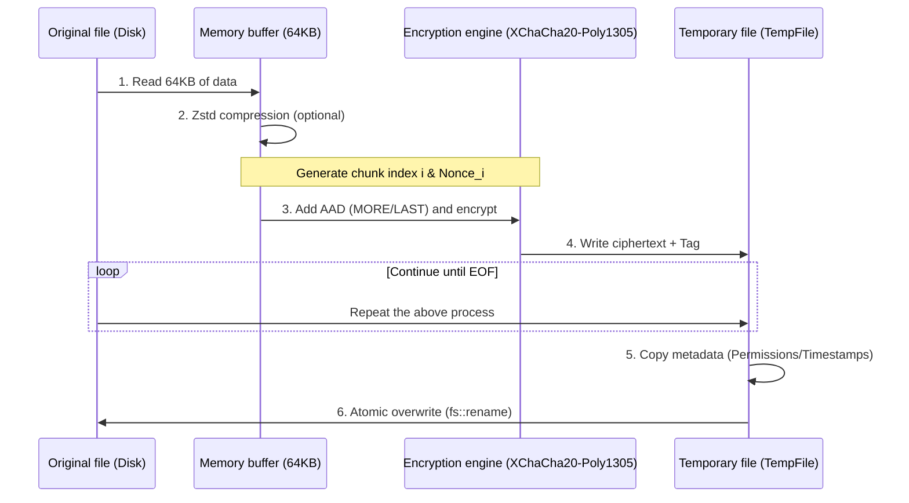

# git-simple-encrypt

English | [简体中文](./docs/README_zh-CN.md)

A simple, secure git encryption tool. With just one password, you can encrypt/decrypt your git repository on any device.

- Compared to [git-crypt](https://github.com/AGWA/git-crypt), it does not require managing GPG keys or backing up key files. **Single-password symmetric encryption** is the core principle.
- Security: v2.0.0+ has been completely refactored, using **Argon2 + XChaCha20-Poly1305** to ensure security, suitable for production environments.
- Streaming & tamper resistance: 64KB chunk encryption reduces memory usage for large files. Each chunk includes AEAD authentication, making file tampering detectable.
- Parallel acceleration: Multi-threaded parallel encryption/decryption makes full use of multi-core CPU performance.
- Metadata retention: Atomic write during encryption/decryption preserves original file permissions and timestamps.
- Zstd compression: Enabled by default.

## Installation

You can choose **any** of the following methods:

- Download the file from [Releases](https://github.com/lxl66566/git-simple-encrypt/releases), extract it, and place it in any directory that exists in your `PATH` environment variable.
- Use [bpm](https://github.com/lxl66566/bpm):
  ```sh
  bpm i git-simple-encrypt -b git-se -q
  ```
- Use [scoop](https://scoop.sh/):
  ```sh
  scoop bucket add absx https://github.com/absxsfriends/scoop-bucket
  scoop install git-simple-encrypt
  ```
- Use [cargo-binstall](https://github.com/cargo-bins/cargo-binstall):
  ```sh
  cargo binstall git-simple-encrypt
  ```
- Build from source:
  ```sh
  cargo install git-simple-encrypt
  ```

## Usage

```sh
git-se p                    # Set/update master password
git-se add file.txt         # Add a file to the encryption list
git-se add mydir            # Add a folder to the encryption list, then recursively encrypt all files under it
git-se e                    # Encrypt all files in the list
git-se d                    # Decrypt all files in the list
git-se e xxx.txt dir1 ...   # Encrypt specific files
git-se d xxx.txt dir1 ...   # Decrypt specific files
```

## Notes

- Configuration file: The encryption list and configuration are stored in `git_simple_encrypt.toml`. To remove a file from the list, edit this file manually.
- Migration Note: The algorithms of v1.x and v2.x are incompatible. Please first decrypt all files in the repository, remove all wildcard patterns from the `git_simple_encrypt.toml` list (wildcards are not supported in v2.x), and then upgrade to v2.x.

---

## How it works

The encryption process for v2.0.0+ is as follows:

### 1. Key Derivation

- It uses the Argon2 algorithm combined with a 16‑byte Salt from the file to derive a 32‑byte strong key. (Files encrypted in the same batch share the same Salt.)
- A DashMap caches derived keys to reduce repeated Argon2 computations.

### 2. Header Structure

Each encrypted file contains a standard header:

```text
 00          04  05  06  07           17                  2F              3F
 +-----------+---+---+---+-----------+-------------------+---------------+
 |   MAGIC   | V | F | A |   SALT    |     NONCE         |   RESERVED    |
 |  "GITSE"  |   |   |   | (16 bytes)|    (24 bytes)     |  (16 bytes)   |
 +-----------+---+---+---+-----------+-------------------+---------------+
      |        |   |   |
      |        |   |   +--- Encryption algorithm (1 = XChaCha20-Poly1305)
      |        |   +------- Compression flag (Bit 0: Zstd compression enabled?)
      |        +----------- Version number (currently 2)
      +-------------------- Magic number
```

### 3. Encryption Logic

- Algorithm: The file is split into 64KB chunks and encrypted using XChaCha20-Poly1305.
- Nonce Derivation: Each chunk uses a different nonce. Derivation rule: overwrite bytes [16..24] of the Base Nonce (24 bytes) with the chunk index `i`.
- AAD: Non‑final chunks: `AAD = "MORE"`, final chunk: `AAD = "LAST"`.


