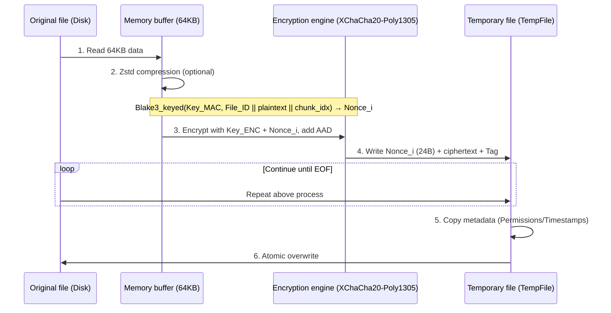

# git-simple-encrypt

English | [简体中文](./docs/README_zh-CN.md)

A secure, high-performance, easy-to-use Git encryption tool. With just one password, you can encrypt/decrypt specified files in your Git repository on any device.

- Compared to [git-crypt](https://github.com/AGWA/git-crypt), it does not require managing GPG keys or backing up key files. **Single-password symmetric encryption** is the core principle.
- Security: v2.0.0+ have been completely refactored, using **Argon2 + XChaCha20-Poly1305** to ensure security, suitable for production environments.
  - The algorithm resists bit tampering, reordering attacks, replay attacks, and truncation attacks. See [How it works](#how-it-works) for details.
- Deterministic guarantee: Salt + FILE_ID are cached during decryption and reused during encryption. If **the file has not changed, the encrypted output is also the same**, preventing repository bloat from repeated encryption/decryption. In v3.0.0+, the Nonce is derived from the current chunk plaintext + File_ID + chunk_idx, maintaining determinism while eliminating Nonce reuse risks and cross-file chunk collision issues.
- Streaming: Uses 64KB chunk encryption to reduce memory usage for large files.
- Parallel acceleration: Multi-threaded parallel encryption/decryption, fully utilizing multi-core CPU performance.
- Atomic writes: Encryption/decryption process implements atomic writes to prevent file corruption if interrupted; preserves original file permissions and timestamps.
- Configurable Zstd compression: Enabled by default to reduce storage space.

## Installation

You can choose **any** of the following methods:

- Download the file from [Releases](https://github.com/lxl66566/git-simple-encrypt/releases), extract it, and place it in any directory included in your `PATH` environment variable.
- Use [bpm](https://github.com/lxl66566/bpm):
  ```sh
  bpm i git-simple-encrypt -b git-se -q
  ```
- Use [scoop](https://scoop.sh/):
  ```sh
  scoop bucket add absx https://github.com/absxsfriends/scoop-bucket
  scoop install git-simple-encrypt
  ```
- Use [cargo-binstall](https://github.com/cargo-bins/cargo-binstall):
  ```sh
  cargo binstall git-simple-encrypt
  ```
- Build from source:
  ```sh
  cargo install git-simple-encrypt
  ```

## Usage

```sh
git-se p                    # Set/update master password
git-se add file.txt mydir   # Add files/directories to the encryption list. If a directory is specified, all files inside will be encrypted recursively
git-se e                    # Encrypt all files in the list
git-se d                    # Decrypt all files in the list
git-se e xxx.txt dir1 ...   # Encrypt specific files
git-se d xxx.txt dir1 ...   # Decrypt specific files
git-se i                    # Install pre-commit hook, which checks that all files are encrypted before each commit
```

## Important Notes

- Configuration file: The encryption list and configuration are stored in `git_simple_encrypt.toml`. To remove a file from the list, edit this file manually.
- Migration notice:
  - Encryption/decryption algorithms are incompatible across major versions. First decrypt all files in the repository. For v1.x -> v2.x, also remove all wildcard entries from the `git_simple_encrypt.toml` list (v2.x+ does not support wildcards), then upgrade the version.

---

## How it works

The encryption process for v3.0.0+ is as follows:

### 1. Key Derivation

- The program uses the Argon2 algorithm combined with a 16-byte file Salt to derive a 32-byte Master Key, then splits it into two independent keys via `blake3::derive_key`. These keys are used for XChaCha20-Poly1305 encryption and for deriving the Nonce for each chunk.
- Derived keys are cached using `DashMap<Salt, Arc<OnceLock>>` to reduce repeated Argon2 computations.

### 2. Header Structure

Each encrypted file contains a standard header (64 bytes):

```text
 00          04  05  06  07           17                  27              3F
 +-----------+---+---+---+-----------+-------------------+---------------+
 |   MAGIC   | V | F | A |   SALT    |      FILE_ID      |   RESERVED    |
 |  "GITSE"  |   |   |   | (16 bytes)|    (16 bytes)     |  (24 bytes)   |
 +-----------+---+---+---+-----------+-------------------+---------------+
      |        |   |   |
      |        |   |   +--- Encryption algorithm (1 = XChaCha20-Poly1305)
      |        |   +------- Compression flag (Bit 0: Zstd compression enabled)
      |        +----------- Version number (currently 3)
      +-------------------- Magic number
```

- FILE_ID: A 16-byte random identifier generated each time a new file is encrypted, used for Nonce derivation.

### 3. Encryption Logic

- Algorithm: Files are split into 64KB chunks and encrypted using XChaCha20-Poly1305.
- Nonce derivation: The nonce for each chunk is derived from the File_ID and the plaintext of the current chunk using keyed Blake3 hashing: `Nonce_i = Blake3_keyed(Key_MAC, File_ID || M_i || chunk_idx)[0..24]`
- AAD: Includes the full 64-byte HEADER + chunk_idx (8 bytes) + is_last_chunk (1 byte), totaling 73 bytes. The HEADER is bound as AAD for all chunks.
- Storage format: The physical structure of each encrypted chunk is `[NONCE (24B)] [CIPHERTEXT (<= 64KB)] [Poly1305 TAG (16B)]`, with the Nonce stored at the chunk header.



Decryption: Read 24 bytes from the file as `Nonce_i`, then read the subsequent ciphertext + Tag, and directly call XChaCha20-Poly1305 decryption.

### 4. Deterministic Re-encryption (Salt + File_ID Caching)

To ensure that a decrypt -> encrypt cycle produces exactly the same ciphertext for the same file, the program persists the Salt and File_ID for each file in `.git/git-simple-encrypt-salt-cache`.

- Encryption (read-only cache): The cache file is mapped to memory via mmap, and rkyv zero-copy deserialization allows direct lookups.
- Decryption (write cache): Rayon threads send `(path, salt, file_id)` through an mpsc channel; the main thread collects them, serializes via rkyv, and atomically writes to disk, merging with the existing cache.
  - The cache key uses the raw bytes of the repository-relative path (with `/` as the separator), ensuring cross-platform consistency.
