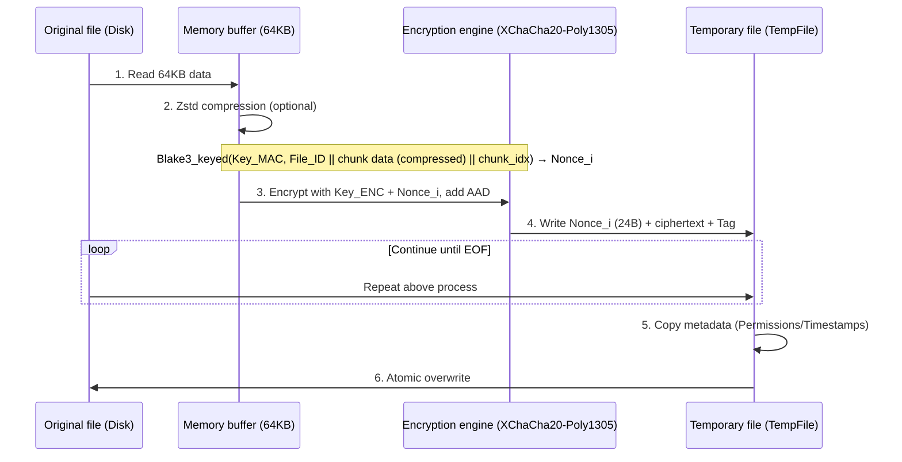

# git-simple-encrypt

English | [简体中文](./docs/README_zh-CN.md)

A secure, high-performance, easy-to-use Git encryption tool. With just one password, you can encrypt/decrypt specified files in your Git repository on any device.

- Compared to [git-crypt](https://github.com/AGWA/git-crypt), it does not require managing GPG keys or backing up key files. **Single-password symmetric encryption** is the core principle.
- Security: v2.0.0+ have been completely refactored, using **Argon2 + XChaCha20-Poly1305** to ensure security, suitable for production environments.
  - The algorithm resists bit tampering, reordering attacks, replay attacks, and truncation attacks. See [How it works](#how-it-works) for details.
- Deterministic guarantee: Salt + FILE_ID are cached during decryption and reused during encryption. If **the file has not changed, the encrypted output is also the same**, preventing repository bloat from repeated encryption/decryption. In v3.0.0+, the Nonce is derived from the current chunk data (after optional compression) + File_ID + chunk_idx, maintaining determinism while eliminating Nonce reuse risks and cross-file chunk collision issues.
- Streaming: Uses 64KB chunk encryption to reduce memory usage for large files.
- Parallel acceleration: Multi-threaded parallel encryption/decryption, fully utilizing multi-core CPU performance.
- Atomic writes: Encryption/decryption process implements atomic writes to prevent file corruption if interrupted; preserves original file permissions and timestamps.
- Configurable Zstd compression: Enabled by default to reduce storage space.
- Transparent git integration (v3.1+): `git-se i` installs clean/smudge filters so encryption and decryption happen automatically on `git add`/`git checkout`, while the working tree stays plaintext and `git diff` remains readable.

## Installation

You can choose **any** of the following methods:

- Download the file from [Releases](https://github.com/lxl66566/git-simple-encrypt/releases), extract it, and place it in any directory included in your `PATH` environment variable.
- Use [bpm](https://github.com/lxl66566/bpm):
  ```sh
  bpm i git-simple-encrypt -b git-se -q
  ```
- Use [scoop](https://scoop.sh/):
  ```sh
  scoop bucket add absx https://github.com/absxsfriends/scoop-bucket
  scoop install git-simple-encrypt
  ```
- Use [cargo-binstall](https://github.com/cargo-bins/cargo-binstall):
  ```sh
  cargo binstall git-simple-encrypt
  ```
- Build from source:
  ```sh
  cargo install git-simple-encrypt
  ```
- NixOS users can install from [my NUR](https://github.com/lxl66566/NUR).

## Usage

### Automatic Encryption/Decryption (v3.1+)

```sh
git-se p                    # Set/update the master password
git-se add file.txt mydir   # Add a file/folder to the encryption list. If it is a folder, all files under it are encrypted recursively
git-se i                    # Install the Git filter integration
git add . && git commit -m "..."   # Just work normally
```

After installation, encryption/decryption is fully transparent: `git add` / `git commit` automatically encrypt; `git checkout` / `git switch` / `git stash` automatically decrypt. The working tree is always plaintext. diff is supported. To migrate an existing repository, run `git-se i` once.

- `.gitattributes` will get a managed block surrounded by `# BEGIN git-simple-encrypt (managed)` / `# END git-simple-encrypt` markers; put custom rules outside the block. git-se automatically refreshes this block when the encryption list changes.

### Manual Encryption/Decryption (Older Versions)

```sh
git-se e                    # Encrypt all files in the encryption list
git-se d                    # Decrypt all files in the list
git-se e xxx.txt dir1 ...   # Encrypt selected files
git-se d xxx.txt dir1 ...   # Decrypt selected files
git-se check                # Check that all files in the encryption list are encrypted (alias: c)
git-se check --staged       # Only check files staged for commit (used by the pre-commit hook)
git-se i --mode hook        # Install a pre-commit hook to check that all files are encrypted before each commit
```

### Global Option

`-r, --repo <REPO>` selects the target repository (relative or absolute path, default `.`). It is a global option and may be placed before or after the subcommand: `git-se --repo /path/to/repo add file.txt` and `git-se add file.txt --repo /path/to/repo` are equivalent.

## Important Notes

- Configuration file: The encryption list and configuration are stored in `git_simple_encrypt.toml`. To remove a file from the list, edit this file manually.
- Migration notice:
  - Encryption/decryption algorithms are incompatible across major versions. First decrypt all files in the repository. For v1.x -> v2.x, also remove all wildcard entries from the `git_simple_encrypt.toml` list (v2.x+ does not support wildcards), then upgrade the version.

## Security Notes

- Password storage: the password set by `git-se p` or `git-se set key` (the raw password, before key derivation) is stored in plaintext in the repo-local git config (`.git/config`, entry `git-simple-encrypt.key`). Any local process, sync service, or backup that can read the repository directory can obtain it. This is an inherent trade-off of the single-password design; do not place the repository in untrusted sync or backup locations.
- Key derivation: Argon2 runs with fixed default parameters (Argon2id, m=19MiB, t=2, p=1). They are not written into the file header and are therefore a frozen part of the on-disk format: existing files cannot be decrypted with different parameters (a mismatch is indistinguishable from a wrong password), so the parameters cannot change within a major version. Exposing them as options is planned for the next major version, which would record a parameter identifier in the reserved header bytes.
- AEAD implementation: XChaCha20-Poly1305 is provided by the `chacha20poly1305-simd` crate (chosen for its explicit-SIMD performance). It is not part of the RustCrypto audited series. `Cargo.toml` tracks it with a caret semver requirement (`"0.3"`), so compatible minor updates are allowed; the exact version compiled into a build is what `Cargo.lock` pins.
- Determinism vs. Zstd versions: when compression is enabled, the nonce is derived from the compressed chunk data, so the ciphertext also depends on the exact byte output of the Zstd encoder. Upgrading the zstd crate may change compressed output for unchanged input, which would make re-encryption of an unchanged file produce different ciphertext (a phantom modification in `git status`); the data itself stays decryptable. Such upgrades are held back within a major version when possible.
- Decompression: decrypted data is decompressed to disk with no fill limit (bounded only by the zstd window), the same as general-purpose decompression tools; a known-password, low-risk disclosure.

---

## How it works

The encryption process for v3.0.0+ is as follows:

### 1. Key Derivation

- The program uses the Argon2 algorithm combined with a 16-byte file Salt to derive a 32-byte Master Key, then splits it into two independent keys via `blake3::derive_key`. These keys are used for XChaCha20-Poly1305 encryption and for deriving the Nonce for each chunk.
- Derived keys are cached using `DashMap<Salt, Arc<OnceLock>>` to reduce repeated Argon2 computations.

### 2. Header Structure

Each encrypted file contains a standard header (64 bytes):

```text
 00            05  06  07  08                  18                  28              3F
 +-------------+---+---+---+-----------------+-------------------+---------------+
 |    MAGIC    | V | F | A |      SALT       |      FILE_ID      |   RESERVED    |
 |   "GITSE"   |   |   |   |    (16 bytes)   |    (16 bytes)     |  (24 bytes)   |
 +-------------+---+---+---+-----------------+-------------------+---------------+
        |        |   |   |
        |        |   |   +--- Encryption algorithm (1 = XChaCha20-Poly1305)
        |        |   +------- Compression flag (Bit 0: Zstd compression enabled)
        |        +----------- Version number (currently 3)
        +-------------------- Magic number (5 bytes "GITSE")
```

- FILE_ID: A 16-byte random identifier generated each time a new file is encrypted, used for Nonce derivation.

### 3. Encryption Logic

- Algorithm: Files are split into 64KB chunks and encrypted using XChaCha20-Poly1305.
- Nonce derivation: The nonce for each chunk is derived from the File_ID and the chunk data actually fed into the cipher (the compressed bytes when Zstd is enabled, since the compression stream is chunked before encryption) using keyed Blake3 hashing: `Nonce_i = Blake3_keyed(Key_MAC, File_ID || D_i || chunk_idx)[0..24]`
- AAD: Includes the full 64-byte HEADER + chunk_idx (8 bytes) + is_last_chunk (1 byte), totaling 73 bytes. The HEADER is bound as AAD for all chunks.
- Storage format: The physical structure of each encrypted chunk is `[NONCE (24B)] [CIPHERTEXT (<= 64KB)] [Poly1305 TAG (16B)]`, with the Nonce stored at the chunk header.


```mermaid
sequenceDiagram
    participant F as Original file (Disk)
    participant M as Memory buffer (64KB)
    participant E as Encryption engine (XChaCha20-Poly1305)
    participant T as Temporary file (TempFile)

    F->>M: 1. Read 64KB data
    M->>M: 2. Zstd compression (optional)
    Note over M,E: Blake3_keyed(Key_MAC, File_ID || chunk data (compressed) || chunk_idx) → Nonce_i
    M->>E: 3. Encrypt with Key_ENC + Nonce_i, add AAD
    E->>T: 4. Write Nonce_i (24B) + ciphertext + Tag
    loop Continue until EOF
        F->>T: Repeat above process
    end
    T->>T: 5. Copy metadata (Permissions/Timestamps)
    T->>F: 6. Atomic overwrite
```

Decryption: Read 24 bytes from the file as `Nonce_i`, then read the subsequent ciphertext + Tag, and directly call XChaCha20-Poly1305 decryption.

### 4. Deterministic Re-encryption (Salt + File_ID Caching)

To ensure that a decrypt -> encrypt cycle produces exactly the same ciphertext for the same file, the program persists the Salt and File_ID for each file in `.git/git-simple-encrypt-salt-cache`.

- Encryption (read-only cache): The cache file is mapped to memory via mmap, and rkyv zero-copy deserialization allows direct lookups.
- Decryption (write cache): Worker threads of the parallel backend (youpipe by default; rayon behind the `rayon-backend` feature) send `(path, salt, file_id)` through an mpsc channel; the main thread collects them, serializes via rkyv, and atomically writes to disk, merging with the existing cache.
  - The cache key uses the raw bytes of the repository-relative path (with `/` as the separator), ensuring cross-platform consistency.
