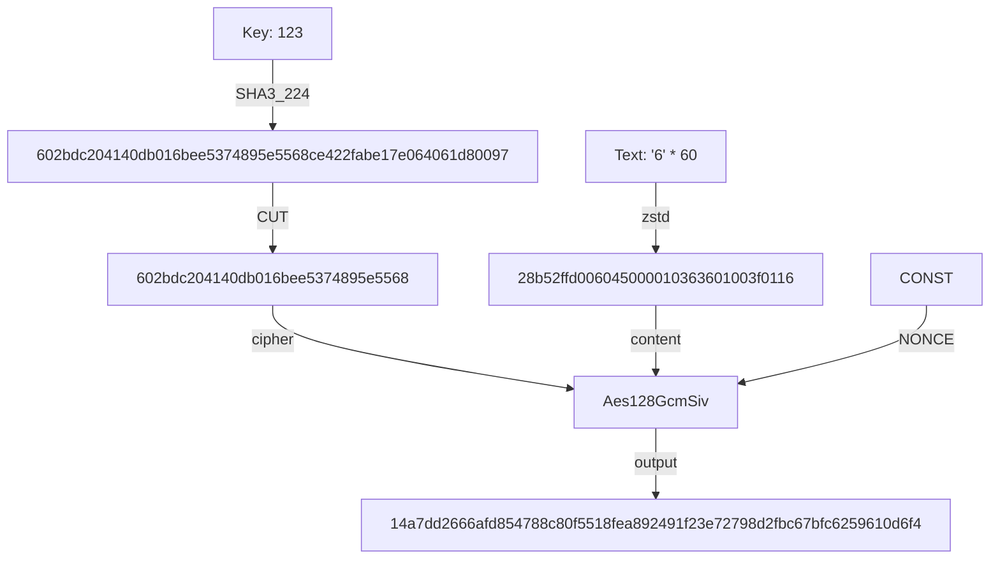

# git-simple-encrypt

[English](../README.md) | 简体中文

这是一个非常简单易用的 git 加密工具，只需一个密码，即可在任何设备上加密/解密您的 git 仓库。支持部分文件加密，增量加密。

- 为什么不使用 [`git-crypt`](https://github.com/AGWA/git-crypt)？
  - **比起安全性，本项目更加注重易用性。** 单密码对称加密是我的底线。

> [!WARNING]  
> **本仓库不对加密安全性与向后兼容性作出任何保证。** （请使用同一个大版本）

## 安装

有几种不同方法可以安装此程序，您可以选择其中**任意一种**。

- 在 [Releases](https://github.com/lxl66566/git-simple-encrypt/releases) 中下载文件并解压，放入 `C:\Windows\System32`（如果您用的是 windows）或任意 `Path` 目录下。
- 使用 [bpm](https://github.com/lxl66566/bpm)：
  ```sh
  bpm i git-simple-encrypt -b git-se -q
  ```
- 使用 [scoop](https://scoop.sh/)：
  ```sh
  scoop bucket add absx https://github.com/absxsfriends/scoop-bucket
  scoop install git-simple-encrypt
  ```
- 使用 cargo：
  ```sh
  cargo +nightly install git-simple-encrypt
  ```
  或 [cargo-binstall](https://github.com/cargo-bins/cargo-binstall)：
  ```sh
  cargo binstall git-simple-encrypt
  ```

## 使用

```sh
git-se p                # 设置密码
git-se add file.txt     # 将 `file.txt` 添加到加密列表
git-se add mydir        # 将 `mydir` 添加到加密列表
git-se e                # 加密当前仓库所有列表内的文件
git-se d                # 解密...
git-se d 'src/*'        # 部分解密
```

`git-se -h` 和 `git-se [subcommand] -h` 查看更多帮助。

## 注意事项

- 加密时会自动执行 `git add -A`，请确保已妥善处理 `.gitignore`。
- 请不要将 `.zst`, `.enc` 后缀的文件以及包含它们的文件夹添加到加密列表中。
- 如果您需要从加密列表中删除文件(夹)，请手动编辑 `git_simple_encrypt.toml`。

## 原理



- 如果 zstd 压缩后具有反效果，则跳过压缩。
- 解密时对所有 `.enc`, `.zst.enc` 进行解密。

## TODO

- [ ] zstd effect checking
- [x] partial decrypt
