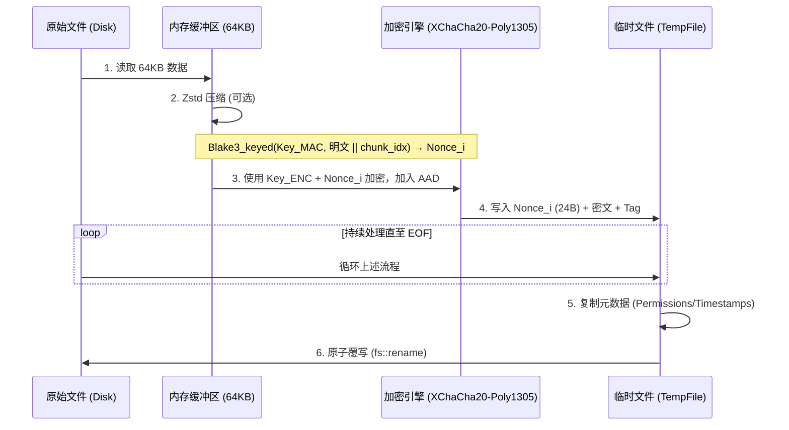

# git-simple-encrypt

[English](../README.md) | 简体中文

这是一个简单、安全的 git 加密工具。只需一个密码，即可在任何设备上加密/解密您的 git 仓库。

- 相比 [git-crypt](https://github.com/AGWA/git-crypt)，它不需要管理 GPG 密钥或备份密钥文件。**单密码对称加密**是核心原则。
- 安全性：v2.0.0+ 版本进行了彻底重构，采用 **Argon2 + XChaCha20-Poly1305** 保证安全性，适用于生产环境。
  - 算法可抗位篡改、重排攻击、重放攻击、截断攻击，详见[原理](#原理)。
- 流式处理：采用 64KB 分块加密，降低大文件加密的内存占用。
- 并行加速：多线程并行加解密，充分利用 CPU 多核性能。
- 原子写入：加解密过程实现原子写入，防止加密中断损坏文件；保留原文件的权限与时间戳。
- 可配置的 Zstd 压缩：默认开启，减少空间占用。
- 对偶性保证：解密时缓存 salt 并在加密时复用，若文件无变更则加密产物也相同，避免反复加解密导致仓库体积膨胀。v3.0.0+ Nonce 基于当前分块明文 + keyed Blake3 计算，在保持确定性同时消除了 nonce 重用风险。

## 安装

您可以选择以下**任意一种**方式：

- 在 [Releases](https://github.com/lxl66566/git-simple-encrypt/releases) 中下载文件并解压，放入任意存在于 `PATH` 环境变量的目录下。
- 使用 [bpm](https://github.com/lxl66566/bpm)：
  ```sh
  bpm i git-simple-encrypt -b git-se -q
  ```
- 使用 [scoop](https://scoop.sh/)：
  ```sh
  scoop bucket add absx https://github.com/absxsfriends/scoop-bucket
  scoop install git-simple-encrypt
  ```
- 使用 [cargo-binstall](https://github.com/cargo-bins/cargo-binstall)：
  ```sh
  cargo binstall git-simple-encrypt
  ```
- 从源码编译：
  ```sh
  cargo install git-simple-encrypt
  ```

## 使用

```sh
git-se p                    # 设置/更新主密码
git-se add file.txt  mydir  # 将文件/文件夹添加到加密列表。如果是文件夹，则会递归加密文件夹下的所有文件
git-se e                    # 加密列表中的所有文件
git-se d                    # 解密列表中的所有文件
git-se e xxx.txt dir1 ...   # 部分加密文件
git-se d xxx.txt dir1 ...   # 部分解密文件
git-se i                    # 安装 pre commit hook，在每次提交前检查是否所有文件都已加密
```

## 注意事项

- 配置文件：加密列表与配置存储在 `git_simple_encrypt.toml` 中，如需从列表中删除文件，请手动编辑该文件。
- 迁移须知：
  - 所有的 major version 之间加解密算法都不兼容。请先解密仓库的所有文件，对于 v1.x -> v2.x 还需要去除 `git_simple_encrypt.toml` 列表里的所有 wildcard 格式（v2.x+ 不支持 wildcard），然后再升级版本。

---

## 原理

v2.0.0+ 版本的加密流程如下：

### 1\. 密钥派生

- 程序通过 Argon2 算法结合文件的 16B Salt 派生出 32B 的 Master Key，再通过 `blake3::derive_key` 拆分为两个独立密钥，用于 XChaCha20-Poly1305 加密 + 计算每个分块的 Nonce。
- 利用 DashMap 缓存已派生的密钥，减少重复 Argon2 运算。

### 2\. 头部结构

每个加密文件都包含一个标准头部：

```text
 00          04  05  06  07           17                  2F              3F
 +-----------+---+---+---+-----------+-------------------+---------------+
 |   MAGIC   | V | F | A |   SALT    |     NONCE         |   RESERVED    |
 |  "GITSE"  |   |   |   | (16 bytes)|    (24 bytes)     |  (16 bytes)   |
 +-----------+---+---+---+-----------+-------------------+---------------+
      |        |   |   |
      |        |   |   +--- 加密算法 (1 = XChaCha20-Poly1305)
      |        |   +------- 压缩标志位 (Bit 0: 是否 Zstd 压缩)
      |        +----------- 版本号 (当前为 3，兼容解密版本 2)
      +-------------------- 魔数
```

### 3\. 加密逻辑

- 算法： 文件被切分为 64KB 的块，使用 XChaCha20-Poly1305 进行加密。
- Nonce 派生（v3）： 每个 chunk 的 nonce 基于当前块自身的明文内容，通过带密钥的 Blake3 哈希计算：`Nonce_i = Blake3_keyed(Key_MAC, M_i || chunk_idx)[0..24]`
- AAD： `chunk_idx + (is_last_chunk as u8)`，共 9B
- **存储格式**： 每个加密分块的物理结构为 `[NONCE (24B)] [CIPHERTEXT (<= 64KB)] [Poly1305 TAG (16B)]`，Nonce 存储在分块头部。


```mermaid
sequenceDiagram
    participant F as 原始文件 (Disk)
    participant M as 内存缓冲区 (64KB)
    participant E as 加密引擎 (XChaCha20-Poly1305)
    participant T as 临时文件 (TempFile)

    F->>M: 1. 读取 64KB 数据
    M->>M: 2. Zstd 压缩 (可选)
    Note over M,E: Blake3_keyed(Key_MAC, 明文 || chunk_idx) → Nonce_i
    M->>E: 3. 使用 Key_ENC + Nonce_i 加密，加入 AAD
    E->>T: 4. 写入 Nonce_i (24B) + 密文 + Tag
    loop 持续处理直至 EOF
        F->>T: 循环上述流程
    end
    T->>T: 5. 复制元数据 (Permissions/Timestamps)
    T->>F: 6. 原子覆写 (fs::rename)
```

解密：从文件读取 24 字节作为 `Nonce_i`，读取后续的密文 + Tag，直接调用 XChaCha20-Poly1305 解密。

### 4. 确定性重加密（Salt + Nonce 缓存）

为保证 decrypt -> encrypt 循环产生完全相同的密文（避免 Git 仓库膨胀），程序在 `.git/git-simple-encrypt-salt-cache` 中持久化每个文件的 Salt 和 Nonce。

- 加密（只读缓存）：通过 mmap 将缓存文件映射到内存，rkyv zerocopy 反序列化直接查询。
- 解密（写入缓存）：Rayon 工作线程通过 mpsc channel 发送 `(path, salt, nonce)` 条目，主线程收集后通过 rkyv 序列化，并使用原子写入持久化到磁盘，与已有缓存合并。
  - 缓存 key 使用仓库相对路径的原始字节（`/` 作为分隔符），确保跨平台一致性。
