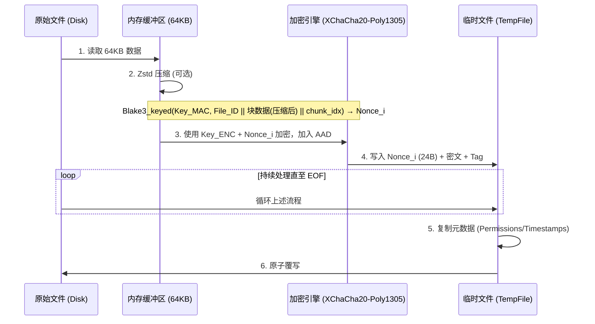

# git-simple-encrypt

[English](../README.md) | 简体中文

这是一个安全、高性能、易于使用的 git 加密工具。只需一个密码，即可在任何设备上加密/解密您的 git 仓库内的指定文件。

- 相比 [git-crypt](https://github.com/AGWA/git-crypt)，它不需要管理 GPG 密钥或备份密钥文件。**单密码对称加密**是核心原则。
- 安全性：v2.0.0+ 版本进行了彻底重构，采用 **Argon2 + XChaCha20-Poly1305** 保证安全性，适用于生产环境。
  - 算法可抗位篡改、重排攻击、重放攻击、截断攻击，详见[原理](#原理)。
- 对偶性保证：解密时缓存 salt + FILE_ID，并在加密时复用，若**文件无变更则加密产物也相同**，避免反复加解密导致仓库体积膨胀。v3.0.0+ Nonce 基于当前分块数据（启用压缩时为压缩后数据）+ File_ID + chunk_idx 计算，在保持确定性同时消除了 Nonce 重用风险和跨文件数据块碰撞问题。
- 流式处理：采用 64KB 分块加密，降低大文件加密的内存占用。
- 并行加速：多线程并行加解密，充分利用 CPU 多核性能。
- 原子写入：加解密过程实现原子写入，防止中断时损坏文件；保留原文件的权限与时间戳。
- 可配置的 Zstd 压缩：默认开启，减少空间占用。
- 透明的 git 集成（v3.1+）：`git-se i` 安装 clean/smudge 过滤器，在 add/checkout 时自动加解密，工作区始终是明文，`git diff` 仍可读。

## 安装

您可以选择以下**任意一种**方式：

- 在 [Releases](https://github.com/lxl66566/git-simple-encrypt/releases) 中下载文件并解压，放入任意存在于 `PATH` 环境变量的目录下。
- 使用 [bpm](https://github.com/lxl66566/bpm)：
  ```sh
  bpm i git-simple-encrypt -b git-se -q
  ```
- 使用 [scoop](https://scoop.sh/)：
  ```sh
  scoop bucket add absx https://github.com/absxsfriends/scoop-bucket
  scoop install git-simple-encrypt
  ```
- 使用 [cargo-binstall](https://github.com/cargo-bins/cargo-binstall)：
  ```sh
  cargo binstall git-simple-encrypt
  ```
- 从源码编译：
  ```sh
  cargo install git-simple-encrypt
  ```
- NixOS 用户可以通过[我的 NUR](https://github.com/lxl66566/NUR) 安装。

## 使用

### 自动加解密（v3.1+）

```sh
git-se p                    # 设置/更新主密码
git-se add file.txt mydir   # 将文件/文件夹添加到加密列表。如果是文件夹，则会递归加密文件夹下的所有文件
git-se i                    # 安装 git 过滤器集成
git add . && git commit -m "..."   # 正常工作即可
```

安装后加解密完全透明：`git add` / `git commit` 自动加密；`git checkout` / `git switch` / `git stash` 时自动解密。工作区始终是明文。支持 diff。迁移现有仓库请运行一次 `git-se i`。

- `.gitattributes` 会增加一个由 `# BEGIN git-simple-encrypt (managed)` / `# END git-simple-encrypt` 标记包围的托管块；自定义规则请放在块外。加密列表变更时 git-se 会自动刷新该块。

### 手动加解密（老版本）

```sh
git-se e                    # 加密列表中的所有文件
git-se d                    # 解密列表中的所有文件
git-se e xxx.txt dir1 ...   # 部分加密文件
git-se d xxx.txt dir1 ...   # 部分解密文件
git-se check                # 检查加密列表中的所有文件是否已加密（别名：c）
git-se check --staged       # 仅检查已暂存待提交的文件（pre-commit hook 使用）
git-se i --mode hook        # 安装 pre commit hook，在每次提交前检查是否所有文件都已加密
```

### 全局参数

`-r, --repo <REPO>` 指定目标仓库路径（支持相对与绝对路径，默认 `.`）。它是全局参数，可放在子命令之前或之后：`git-se --repo /path/to/repo add file.txt` 与 `git-se add file.txt --repo /path/to/repo` 等价。

## 注意事项

- 配置文件：加密列表与配置存储在 `git_simple_encrypt.toml` 中，如需从列表中删除文件，请手动编辑该文件。
- 迁移须知：
  - 所有的 major version 之间加解密算法都不兼容。请先解密仓库的所有文件，对于 v1.x -> v2.x 还需要去除 `git_simple_encrypt.toml` 列表里的所有 wildcard 格式（v2.x+ 不支持 wildcard），然后再升级版本。

## 安全说明

- 密码存储：通过 `git-se p` 或 `git-se set key` 设置的密码（派生密钥前的原始密码）以明文存储在仓库本地 git 配置中（`.git/config` 的 `git-simple-encrypt.key` 项），任何能读取仓库目录的本地进程、同步盘与备份均可获取。这是「单密码」设计的固有代价，请勿将仓库目录置于不受信任的同步或备份位置。
- 密码输入与传输：交互式输入会关闭终端回显；当 stdin 不是终端（管道、CI）时退化为按行读取。密码写入 `.git/config` 采用直接编辑文件、按 git 兼容的值转义规则写入的方式，全程不经过任何子进程的命令行参数（进程列表）；派生密钥与加密缓冲在内存中随 drop 清零。
- 密钥派生：Argon2 使用固定默认参数（Argon2id，m=19MiB，t=2，p=1）。参数不写入文件头，因此属于磁盘格式的冻结部分：换参数将无法解密既有文件（且参数不匹配与密码错误无法区分），所以 major 版本内参数不可调整。计划在下个 major 版本将参数暴露为配置项，并在头部保留字节中记录参数标识。
- AEAD 实现：XChaCha20-Poly1305 由 `chacha20poly1305-simd` crate 提供（出于其显式 SIMD 的性能动机），该 crate 不在 RustCrypto 审计系列内。`Cargo.toml` 以 caret semver（`"0.3"`）跟踪其版本，允许兼容的次版本更新；实际参与构建的确切版本由 `Cargo.lock` 锁定。
- 确定性与 Zstd 版本：启用压缩时 Nonce 基于压缩后的分块数据派生，因此密文还依赖于 Zstd 编码器的确切字节输出。升级 zstd crate 可能改变相同输入的压缩输出，使未变更文件重加密后产生不同密文（在 `git status` 中表现为幻影修改）；数据本身始终可解密。此类升级在 major 版本内会尽量推迟。
- 解压：解密后的数据解压写盘无磁盘填充上限（仅受 zstd window 限制），与通用解压工具一致；仅在已知密码场景下才会到达解压路径，属低风险披露。

---

## 原理

v3.0.0+ 版本的加密流程如下：

### 1\. 密钥派生

- 程序通过 Argon2 算法结合文件的 16B Salt 派生出 32B 的 Master Key，再通过 `blake3::derive_key` 拆分为两个独立密钥，用于 XChaCha20-Poly1305 加密 + 计算每个分块的 Nonce。
  - 利用 `DashMap<Salt, Arc<OnceLock>>` 缓存已派生的密钥，减少重复 Argon2 运算。

### 2\. 头部结构

每个加密文件都包含一个标准头部（64 字节）：

```text
 00            05  06  07  08                  18                  28              3F
 +-------------+---+---+---+-----------------+-------------------+---------------+
 |    MAGIC    | V | F | A |      SALT       |      FILE_ID      |   RESERVED    |
 |   "GITSE"   |   |   |   |    (16 bytes)   |    (16 bytes)     |  (24 bytes)   |
 +-------------+---+---+---+-----------------+-------------------+---------------+
        |        |   |   |
        |        |   |   +--- 加密算法 (1 = XChaCha20-Poly1305)
        |        |   +------- 压缩标志位 (Bit 0: 是否 Zstd 压缩)
        |        +----------- 版本号 (当前为 3)
        +-------------------- 魔数 (5 bytes "GITSE")
```

- FILE_ID：每次加密新文件时随机生成的 16 字节标识符，用于 Nonce 派生。

### 3\. 加密逻辑

- 算法： 文件被切分为 64KB 的块，使用 XChaCha20-Poly1305 进行加密。
- Nonce 派生： 每个 chunk 的 nonce 基于 File_ID 和进入加密引擎的当前块数据（启用压缩时为压缩后的字节，压缩流在切块之前），通过带密钥的 Blake3 哈希计算：`Nonce_i = Blake3_keyed(Key_MAC, File_ID || D_i || chunk_idx)[0..24]`
- AAD： 完整的 64B HEADER + chunk_idx (8B) + is_last_chunk (1B)，共 73B。HEADER 参与所有 chunk 的 AAD 绑定。
- 存储格式： 每个加密分块的物理结构为 `[NONCE (24B)] [CIPHERTEXT (<= 64KB)] [Poly1305 TAG (16B)]`，Nonce 存储在分块头部。


```mermaid
sequenceDiagram
    participant F as 原始文件 (Disk)
    participant M as 内存缓冲区 (64KB)
    participant E as 加密引擎 (XChaCha20-Poly1305)
    participant T as 临时文件 (TempFile)

    F->>M: 1. 读取 64KB 数据
    M->>M: 2. Zstd 压缩 (可选)
    Note over M,E: Blake3_keyed(Key_MAC, File_ID || 块数据(压缩后) || chunk_idx) → Nonce_i
    M->>E: 3. 使用 Key_ENC + Nonce_i 加密，加入 AAD
    E->>T: 4. 写入 Nonce_i (24B) + 密文 + Tag
    loop 持续处理直至 EOF
        F->>T: 循环上述流程
    end
    T->>T: 5. 复制元数据 (Permissions/Timestamps)
    T->>F: 6. 原子覆写
```

解密：从文件读取 24 字节作为 `Nonce_i`，读取后续的密文 + Tag，直接调用 XChaCha20-Poly1305 解密。

### 4. 确定性重加密（Salt + File_ID 缓存）

为保证 decrypt -> encrypt 循环对相同文件产生完全相同的密文，程序在 `.git/git-simple-encrypt-salt-cache` 中持久化每个文件的 Salt 和 File_ID。

- 加密（只读缓存）：通过 mmap 将缓存文件映射到内存，rkyv zerocopy 反序列化直接查询。
- 解密（写入缓存）：并行后端的工作线程（默认 youpipe，`rayon-backend` feature 可切换为 rayon）通过 mpsc channel 发送 `(path, salt, file_id)`，主线程收集后通过 rkyv 序列化，并原子写入到磁盘，与已有缓存合并。
  - 缓存 key 使用仓库相对路径的原始字节（`/` 作为分隔符），确保跨平台一致性。
