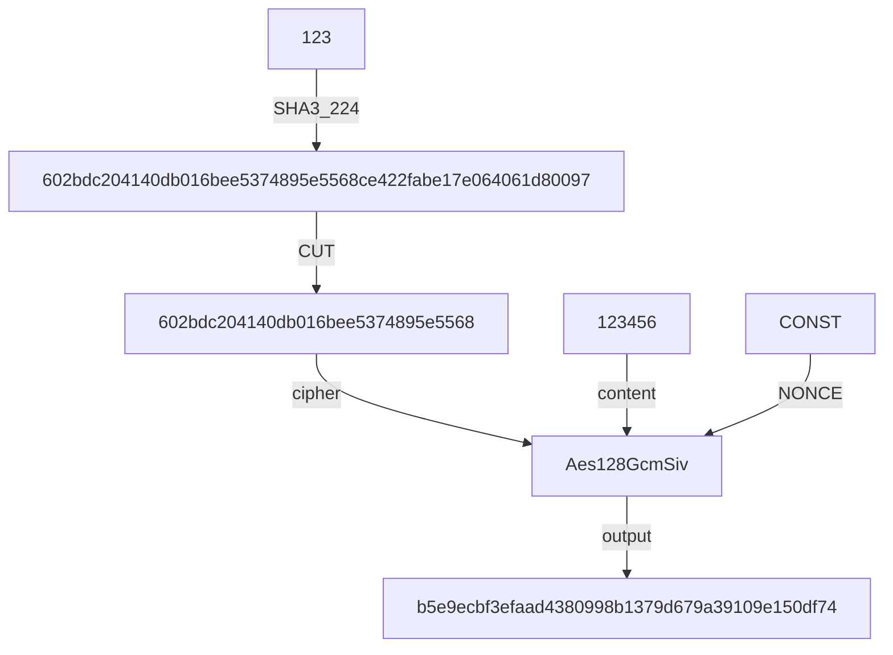

# git-simple-encrypt

English | [简体中文](./docs/README_zh-CN.md)

A **very simple and easy to use** git file encryption tool that encrypts/decrypts your git repositories on any device with one **single password**.

- Why not use [`git-crypt`](https://github.com/AGWA/git-crypt)?
  - **This project is more focused on ease of use than security.** Single-password symmetric encryption is my bottom line.

> [!WARNING]  
> **This repository does not make any guarantees about encryption security and backward compatibility.** (Please use the same major version)

## Installation

There are several different ways to install it, you can choose **any** of them.

- Download the file from [Releases](https://github.com/lxl66566/git-simple-encrypt/releases), unzip and place it in `C:\Windows\System32` (If you're using Windows) or any `Path` directory.
- Using [bpm](https://github.com/lxl66566/bpm):
  ```sh
  bpm i git-simple-encrypt -b git-se -q
  ```
- Using [scoop](https://scoop.sh/):
  ```sh
  scoop bucket add absx https://github.com/absxsfriends/scoop-bucket
  scoop install git-simple-encrypt
  ```
- Using cargo:
  ```sh
  cargo +nightly install git-simple-encrypt
  ```

## Usage

```sh
git-se set 123456           # Set the password to `123456`.
git-se e                    # Encrypt files in list in the current repository.
git-se d                    # Decrypt...
git-se add file.txt         # Add `file.txt` to the need-to-be-encrypted list.
```

## Caution

- `git add -A` is automatically executed when encrypting, so make sure that `.gitignore` is handled properly.

## Algorithm


